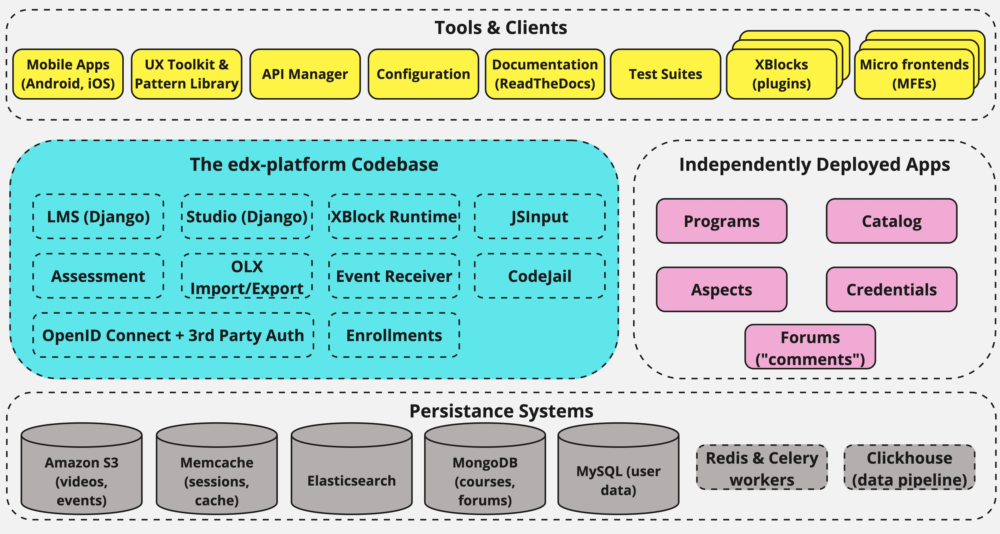

# Open edX AI-Enhanced Deployment Project

## Kickoff & Implementation Roadmap

---

## 📌 Agenda

1. Introduction and Objectives  
2. Overview of AI Capabilities in Open edX  
3. Project Plan: Phases and Timeline  
4. Technical Architecture: Tutor Setup  
5. Deployment Strategy: Dev, Staging, Production  
6. Risks & Mitigations  
7. Next Steps  

---

## 🎯 Project Objective

Establish a robust, scalable, and fully customized Open edX platform tailored to our organization’s learning and operational needs.  
Key focus:
- Secure, enterprise-ready LMS with Tutor deployment
- Deep UX and platform customizations
- Integration with external systems (Dealer, ERP, analytics)
- AI features for content creation, engagement, and reporting

---

## 🏗 Open edX Platform Architecture

Official reference:  
📖 [Developer Architecture Guide](https://docs.openedx.org/en/latest/developers/references/developer_guide/architecture.html)

---

## ☁️ Open edX AWS Cloud Architecture

- Resources in dedicated VPC, across 3 AZs
- Public subnet for internet access & bastion host  
- Private subnets for app and DB tiers  
- Route53, CloudFront, WAF, and SSM for secure access  
- Kubernetes (EKS), Redis (ElastiCache), OpenSearch, RDS (Aurora MySQL), MongoDB  
- LMS uses SES for emails, S3 for static assets  

📖 [Cloud Architecture Details](https://discuss.openedx.org/t/open-edx-cloud-reference-architecture/7277)

---

## 🧱 Tutor-Based Deployment Architecture

- Tutor Dev Mode for local sandbox  
- Dockerized Staging for UAT  
- Production with SSL, LMS Studio, plugins  
- Plugins: xBlocks, AI Coach per environment

---

## 🗓 Project Phases and Milestones

| Phase | Description | Duration |
|-------|-------------|----------|
| 1 | Kickoff & Requirements Alignment | W+1 |
| 2 | Tutor-Based Platform Setup | W+2 - W+3 |
| 3 | Core Platform Customization | W+4 - W+5 |
| 4 | Authentication & SSO | W+6 |
| 5 | Reporting & Data Layer | W+7 - W+8 |
| 6 | AI Capabilities | W+9 - W+10 |
| 7 | System Integration | W+11 - W+12 |
| 8 | QA & UAT | W+13 |
| 9 | Training | W+14 |
| 10 | Go-Live | W+15 |

---

## 🧩 Deliverables by Phase

### Phase 1: Kickoff & Requirements Alignment
- Project charter
- Stakeholder matrix
- Functional specs
- Architecture diagram

### Phase 2: Tutor-Based Setup
- Environments provisioned
- Plugins (SSL, Redis, Mongo)
- Monitoring, CI/CD

### Phase 3: Platform Customization
- Themes
- UX/navigation fixes

### Phase 4: Auth & SSO
- SAML/OAuth2 (AzureAD, Keycloak)
- Role-based access
- Profile sync

---

### Phase 5: Reporting
- KPI & metrics design
- Data export APIs / ETL
- BI-ready schema

### Phase 6: AI Capabilities
- ChatGPT xBlock  
- AI Coach  
- RAG-based generation  
- Ethics & moderation

### Phase 7: System Integration
- HRMS/CRM APIs
- Sync metadata
- Automate recommendations

### Phase 8: QA & UAT
- Testing for all roles
- Feedback collection
- Bug fixing

---

### Phase 9: Training
- Admin/instructor sessions
- SOP documentation
- How-to videos

### Phase 10: Go-Live
- Final release
- Announcement
- SLA-based support

---

## 🧵 Parallel Tracks

### A. Content Migration & AI Creation
- Convert SCORM, PDF, Moodle to OLX
- AI-assisted authoring
- QA and instructor validation

### B. Gamification & Certificates
- Badges, milestones
- Custom certificate templates
- Reward UI in LMS

### C. LTI Tool Integrations
- Tools: Zoom, JupyterHub, CodeRunner  
- LTI Consumer setup  
- Instructor training

---

## 🚀 Next Steps

- Confirm roles and teams  
- Deploy Tutor Dev environment  
- Pilot AI plugin tests  
- Start sandbox course dev  
- Bi-weekly progress reviews  

---

## 🤝 Partner: OpenCraft

OpenCraft is the implementation partner for:
- Tutor-based Dev/Staging/Prod setup  
- AI feature integration (ChatGPT xBlock, AI Coach)  
- RAG-based generation  
- HRMS/CRM/Analytics integration  
- Instructor/admin training  
- SLA-backed support

📩 Contact: [contact@opencraft.com](mailto:contact@opencraft.com)  
🔗 [OpenCraft on Marketplace](https://openedx.org/marketplace/opencraft/)  
🔗 [OpenCraft Contact Page](https://opencraft.com/contact/)

---

## 📚 Appendix: Technology Stack

- [Open edX Platform Overview](https://docs.openedx.org/en/latest/developers/concepts/platform_overview.html)  
- [2024 Open edX Conference](https://openedx.atlassian.net/wiki/spaces/COMM/pages/4251025435/2024+Open+edX+Conference)

